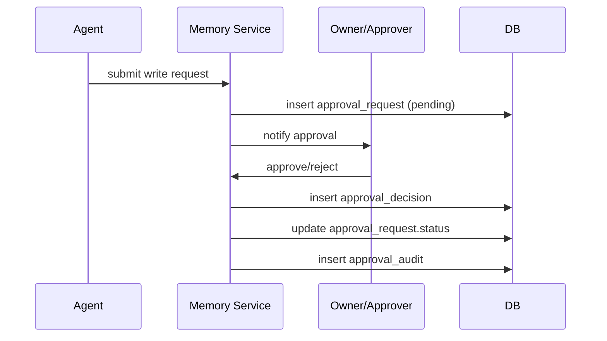

# 架构与设计规范：进化型 AIOps Agent

## 1. 项目愿景
构建一个**双阶段智能平台**：
1. **第一阶段（大脑）**：个人知识库与技术助手，学习用户偏好与代码库。
2. **第二阶段（双手）**：具备实时监控、诊断与自动化修复能力的 AIOps Agent，并形成自学习闭环。

## 2. 核心需求

### 2.1 功能性需求
* **多源 RAG**：从本地代码、Markdown 文档与网页进行采集与检索。
* **混合记忆**：
  * **情节记忆（Episodic）**：向量化召回历史对话与问题。
  * **语义记忆（Semantic）**：SQL 结构化用户偏好（如“使用 Python 3.10”）。
* **主动工具调用**：Agent 必须通过工具执行外部交互（检索、读文件、后续系统运维操作）。
* **自学习闭环**：已解决的运维问题自动总结并写回知识库。

### 2.2 安全与合规（AIOps）
* **人机回环**：高风险操作（如 `restart_service`）必须经过 UI 确认。
* **工具白名单**：严格控制可执行的系统命令。

## 3. 系统架构

### 3.1 逻辑架构（Mermaid）

```mermaid
graph TD
    subgraph "Sensors (Inputs)"
        U[User Chat] --> Router
        W[Webhook / Alert] --> Router
    end

    subgraph "The Core (Agent Runtime)"
        Router{Router}
        Router -- "Query" --> Agent[LangGraph Agent]
        
        Agent <-->|Read/Write| MEM_ST[Short Term Mem]
        Agent <-->|Retrieval| MEM_EP[Episodic Mem (Vector)]
        Agent <-->|Profile| MEM_SEM[User Profile (SQL)]
    end

    subgraph "Effectors (Tools Layer)"
        Agent -- "Call" --> T_RAG[RAG Search Tool]
        Agent -- "Call" --> T_SYS[System Ops Tool]
        Agent -- "Call" --> T_LEARN[Knowledge Writer]
    end

    subgraph "The World"
        T_RAG --> KB[(Knowledge Base)]
        T_SYS --> INFRA[Server / Cloud]
        T_LEARN --> KB
    end

    subgraph "Feedback Loop"
        INFRA -.->|Logs/Status| W
        Agent -.->|Post-Mortem| T_LEARN
    end
```

### 3.2 关键组件
1. **Orchestrator（LangGraph）**：
   * 管理对话与诊断状态。
   * 决策流程：`Retrieve` -> `Plan` -> `Execute Tool` -> `Verify` -> `Result`。
2. **Memory Store**：
   * **ChromaDB（向量）**：存储代码片段、笔记段落与**历史已解决案例**。
   * **SQLite（关系型）**：存储用户画像、会话日志与审计轨迹。
3. **Knowledge Ingestion**：
   * **文本入库**：切分 -> 向量化 -> ChromaDB。
   * **结构化落库**：DocumentChunk 写入 SQLite。
4. **Hybrid Retrieval**：
   * 向量检索 + 关键词检索合并，支持 Top‑K 召回。
5. **Memory Service**：
   * 语义记忆与情节记忆的写入/召回接口。
6. **Agent Runtime**：
   * LangGraph 状态机：`retrieve -> memory -> answer`。

### 3.3 Context Handling Strategy（上下文处理策略）
**Reduction**：
* 对长对话进行摘要，保留关键事实与参数。
* 抽取结构化字段（错误、版本、配置变更等）。
**Offloading**：
* 对话与文档入向量库，按需召回。
**Isolation**：
* 按会话/任务命名空间隔离，避免污染。

示例（LangChain middleware，与短期记忆存储解耦）：
```python
from langchain.agents import create_agent
from langchain.agents.middleware import SummarizationMiddleware

agent = create_agent(
    model="gpt-4o",
    tools=[...],
    middleware=[
        SummarizationMiddleware(
            model="gpt-4o-mini",
            max_tokens_before_summary=4000,
            messages_to_keep=20,
        ),
    ],
)
```

### 3.4 Context Selection Principles（上下文选择原则）
* **时间靠近**：优先保留最近 N 轮。
* **类型优先级**：任务相关 > 工具结果 > 闲聊。
* **可恢复性**：可恢复信息优先卸载，不可恢复信息优先编减保留。

详见：`docs/形成上下文记忆工程.md`。

### 3.5 Long-Term Memory Architecture (Record & Retrieve)
核心组件：
* **LLM**：从短期记忆提取有效信息（理解/抽取/决策）。
* **Embedder**：将文本转为向量，支撑相似检索。
* **VectorStore**：持久化向量与元数据，支持语义检索。
* **GraphStore**：存储实体-关系图谱，支持复杂推理。
* **Reranker**：对初检结果进行语义重排序。
* **SQLite**：记录记忆操作审计日志，支持回溯。

写入触发（折中型）：
* **结案写入（强制）**：问题解决/工单关闭时写入复盘、根因、处理步骤与验证指标。
* **过程写入（可选）**：对话过程中仅写“稳定事实/用户偏好/环境常量”，需达到置信度阈值。

写入内容范围（建议）：
* **情节记忆**：复盘摘要、处理链路、关键上下文（版本/环境/变更/告警窗口）。
* **语义记忆**：用户偏好、稳定事实、策略约束（审批/风险阈值/禁用动作）。
* **禁止写入**：密钥、token、个人敏感信息、低置信度猜测。

召回优先级（建议）：
* **顺序**：语义记忆 > 情节记忆 > 知识记忆。
* **加权**：相关性 × 可信度 × 新近性。
* **特例**：生产告警提升情节记忆权重；新问题提升知识记忆权重；权限敏感优先语义记忆。

生命周期策略（保留/衰减/删除）：
* **保留**：情节记忆默认 180 天可配置；语义记忆长期保留需复核；知识记忆随来源更新。
* **衰减**：时间衰减 + 低命中衰减 + 负反馈快速衰减。
* **删除**：支持撤销、按来源/时间/类型批量清理、租户隔离清理。

写入审批机制（建议）：
* **场景**：prod 写入、高风险动作结论、敏感字段、跨服务/跨租户影响。
* **角色**：Owner + Approver 双确认；SRE/Security/Admin 具备审批权限；支持单人/多级。
* **超时回退**：默认 5 分钟超时，超时拒绝并留痕；可降级为脱敏摘要写入。
* **脱敏降级**：token/密钥/手机号/邮箱/IP 掩码；仅保留结构化摘要与统计量。
* **审计记录**：request_id、case_id、data_class、action_class、审批链与结果。

审批表结构与流程（概要）：
* **表**：approval_request / approval_decision / approval_audit
* **流程**：提交 -> 审批 -> 更新状态 -> 审计留痕（超时/降级同样记录）

审批流程时序（Mermaid）：


#### Record Flow
1. LLM 事实抽取
2. 向量化
3. 向量存储
4. 关系存储（图）
5. SQLite 审计记录

#### Retrieve Flow
1. Query 向量化
2. VectorStore 语义检索
3. GraphStore 关系补充
4. Reranker/LLM 重排序
5. 结果返回

### 3.6 Ops Context Template (K8s / DevOps / Alerts)
建议结构化字段：
1. **Meta**：集群/环境/租户/服务/时间窗口
2. **Context**：命名空间/节点/工作负载/配额
3. **Metrics**：CPU/内存/磁盘/网络/延迟/错误率
4. **Logs**：关键日志片段/堆栈/错误码
5. **Events & Alerts**：告警名称/级别/触发/持续
6. **Change**：版本/配置变更/责任人/时间
7. **Topology**：上下游/依赖/链路
8. **AI Analysis**：根因假设/证据/置信度
9. **Action**：建议步骤/自动化/回滚
10. **Feedback**：结果/验证指标/经验沉淀

详见：`docs/AIOps运维模板.md`。

## 4. 工作流

### 4.1 自学习闭环
1. **触发**：用户标记问题“已解决”。
2. **动作**：触发 `CaseSummarizer`。
3. **过程**：
   * 汇总会话历史。
   * 抽取 `Issue / Root Cause / Resolution / Command Used`。
   * 生成标准化复盘报告（Markdown）。
4. **存储**：元数据入 VectorDB，文件写入 `knowledge/cases/`。
5. **收益**：下次同类问题优先命中。

### 4.2 AIOps Execution（未来）
1. **告警**：Prometheus 向 `/webhook/alert` 推送。
2. **查询**：VectorDB 检索相似问题。
3. **计划**：匹配 Runbook（如“检查 DB 连接”）。
4. **动作**：调用 `check_db_status()` 工具。
5. **汇报**：推送结果给用户，等待审批修复。

## 5. 技术栈
* **语言**：Python 3.11+
* **API 框架**：FastAPI
* **前端**：React + TailwindCSS（Vite）
* **编排**：LangChain / LangGraph
* **向量数据库**：ChromaDB（本地持久化）
* **关系数据库**：SQLite

## 5.1 API 入口（MVP）
- `POST /api/v1/ingest/text`：文本知识采集
- `POST /api/v1/retrieve/hybrid`：混合检索
- `POST /api/v1/memory/record`：记忆写入
- `POST /api/v1/memory/recall`：记忆召回
- `POST /api/v1/evaluate/retrieval`：检索评估
- `POST /api/v1/agent/run`：LangGraph Agent 运行

---

## 6. 业务增强建议（可落地模块）

### 6.1 智能作战室（Incident War Room）
**场景**：AIOps 故障排查（Firefighting）
* **功能**：P0 告警或“启动排查”触发双栏视图。
* **左屏**：实时日志流 + 指标曲线。
* **右屏**：AI 主动推送诊断结论与关联变更。
* **价值**：降低 MTTD，让“信息找人”。

### 6.2 知识园丁（Knowledge Gardener）
**场景**：个人知识库维护
* **功能**：去重、合并、更新过期内容。
* **输出**：改进建议与合并提案。
* **价值**：保持知识库长期健康。

### 6.3 架构审计员（Architecture Auditor）
**场景**：代码/设计评审
* **功能**：用历史 Post-Mortem 检索相似风险。
* **输出**：风险提示与替代方案（如 Retry + Jitter）。
* **价值**：将历史经验前置为事前防御。

### 6.4 采纳优先级
1. 架构审计员（最易落地，价值高）
2. 知识园丁（长期收益显著）
3. 智能作战室（成本高，建议 Phase 2）

---

## 6. 可扩展性分析（从个人助手到 AIOps）

### 6.1 差距分析
当前架构（个人知识库） vs. 未来 AIOps 需求：

| 特性 | 当前方案（Personal KB） | 未来 AIOps 需求 | 差距 |
| :--- | :--- | :--- | :--- |
| **数据源** | 静态（代码/文档/网页） | **实时**（日志/指标/链路） | 缺少时序库或实时数据接入（如 Prometheus/Loki） |
| **动作** | 被动（对话/检索） | **主动**（重启/回滚/扩缩容） | 需要严格权限的 Tool-Use / Function Calling |
| **推理** | RAG | **因果推理**（根因分析） | 需要 GraphRAG（依赖图谱） |
| **速度** | 同步/异步对话 | **事件驱动**（Webhook/告警） | 需要事件总线（Kafka/RabbitMQ） |

### 6.2 可演进设计
为避免未来重构，当前的 FastAPI + LangChain 架构应满足 AIOps Ready：

1. **Tool-Use 设计**：即使在 Personal KB 阶段，也把检索与记忆更新实现为工具接口，便于后续扩展 SSH / K8s 操作。
2. **模块化 Agent**：采用 Router 路由模式，支持从 ChatBot Agent 演进到 DevOps Agent。
3. **日志结构化存储**：当前使用 SQLite，未来可替换为时序数据库适配层而不改业务逻辑。

### 6.3 结论
当前技术栈（FastAPI + LangChain + VectorDB）是 AIOps 的正确基础。
但未来必须引入 **Knowledge Graph / GraphRAG**，用于系统依赖与根因推理。
